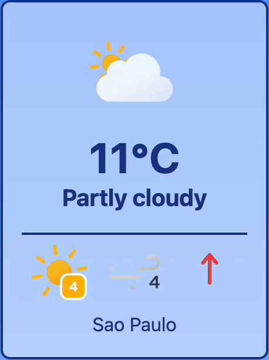
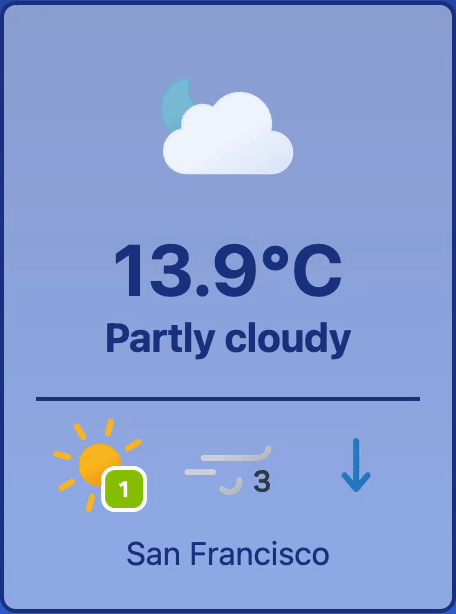

# Orelis

Simple project for learning Vue.

Displays weather data from [WeatherApi](https://www.weatherapi.com/). \
Collects location using [VueUse](https://vueuse.org/). \
Icons from [Meteocons](https://github.com/basmilius/weather-icons).

### Made using:
* 
* 
* 
* 

---

  
  
  

---